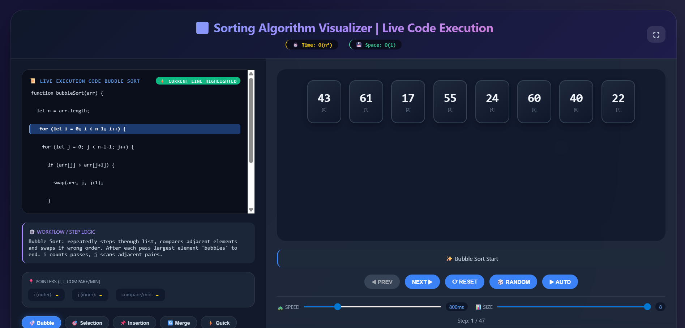

# 🚀 Sorting Visualizer

✨ An advanced interactive Sorting Visualizer built using HTML, CSS, and JavaScript.  
This project helps students understand how different sorting algorithms work internally with step-by-step execution, animations, and live code visualization.

---

## 📸 Preview  

---

## 🎯 Features  

### 🔢 Supported Algorithms  
✔ Bubble Sort  
✔ Selection Sort  
✔ Insertion Sort  
✔ Merge Sort 🔄  
✔ Quick Sort ⚡  

---

### 🎮 Interactive Controls  
✔ Next Step & Previous Step navigation  
✔ Auto Play mode ▶  
✔ Reset & Random array generation 🎲  
✔ Adjustable speed control 🎚️  
✔ Dynamic array size  

---

### 🧠 Visualization Features  
✔ Real-time step-by-step execution  
✔ Live code highlighting 🔥  
✔ Pointer tracking (i, j, min, pivot)  
✔ Smooth animations & transitions 🎬  
✔ Sound effects 🔊  
✔ Fullscreen mode 🖥️  

---

### 📊 Complexity Display  
✔ Time Complexity shown dynamically  
✔ Space Complexity display  

---

## 🧠 Learning Outcomes  

- Understand how sorting algorithms work internally  
- Compare different sorting techniques visually  
- Improve problem-solving and algorithmic thinking  
- Learn step-by-step execution flow  

---

## 🛠️ Tech Stack  

- **HTML5** – Structure  
- **CSS3** – Styling & Animations  
- **JavaScript (ES6)** – Logic & Interactivity  

---

## ⚡ How It Works  

1. Select a sorting algorithm  
2. Generate or reset the array  
3. Use **Next / Previous** to step through  
4. Or click **Auto** for automatic visualization  
5. Observe code execution & pointer movements  

---

## 💡 Future Enhancements  

- Heap Sort 🗻  
- Comparison counter  
- Custom input array  
- Mobile optimization 📱  

---

## 👨‍💻 Author  

**Srinidhi**  

---

## ⭐ Support  

If you like this project, please ⭐ star the repository!  
It motivates me to build more awesome projects 🚀

## Live Demo
 https://bajarsrinidhi-24.github.io/sorting-visualizer/
